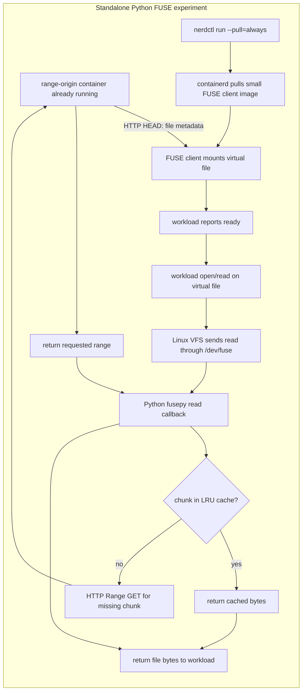

# Container Cold-Start and Lazy-Filesystem PoC

This repository contains two related but distinct experiments for understanding container startup and lazy data access on Rancher Desktop:

1. **Containerd eStargz benchmark:** compares an ordinary image pulled with the `overlayfs` snapshotter against an eStargz-converted image pulled with Stargz Snapshotter. This exercises actual container image layer lazy pulling.
2. **Standalone Python FUSE demonstrator:** exposes one raw payload file through FUSE and fetches HTTP byte ranges on demand. This isolates the filesystem, chunking, and cache ideas. It is not a containerd snapshotter and does not lazily pull OCI layers.

The Python FUSE experiment can make the *client workload container* start sooner by keeping its large payload out of that client's image. The payload origin is a separate service and, in this benchmark, it is already pulled and running before client timing starts. So the result demonstrates a design strategy; it does not prove that total system startup is faster when the origin must also be started.

## Two different image/data paths

`nerdctl run --pull=always` asks Rancher's containerd to pull the selected **client image** from the local registry before starting that container. The FUSE code does not perform this image pull. After the FUSE client starts, a workload file read may cause the Python FUSE daemon to make an HTTP `Range` request for **payload bytes** from the separate origin container.



## Why the Python FUSE design is structured this way

### Keep the data source simple and the file readable

The source is one raw file served with standard HTTP byte ranges, rather than a compressed OCI layer. This keeps the demonstrator focused on the core FUSE path: file offset → chunk number → remote byte range → returned file bytes. Parsing OCI manifests, tar layers, whiteouts, eStargz tables of contents, compressed chunks, and digest metadata would be a much larger project. The separate eStargz benchmark already exercises the real container-image path.

### Separate payload from the measured client image

The Dockerfile creates the same seeded payload for both clients. The baseline image includes the 256 MiB payload layer; the FUSE client image includes the workload and FUSE code but not that payload. A separate origin image holds the payload and range server.

That gives a controlled demonstration of deferring the workload's payload dependency: the FUSE client has less payload data in the image it needs to pull before it can report ready. The benchmark starts the origin before measuring clients, so its image pull/start is excluded. In a real deployment, the origin would need to be already available or its startup/data cost would need to be included.

### Use one file, read-only semantics, and offset-based callbacks

The filesystem exposes only `/` and `/payload.bin`. It implements the operations needed by this workload—metadata, directory listing, open, and read—and rejects writes. Restricting the PoC to one immutable file avoids implementing general-purpose filesystem behavior such as mutation, ownership updates, symlinks, hard links, and a writable overlay.

The FUSE `read` callback receives a path, requested byte count, and offset. It computes the first and last chunk touched by the read, so non-zero and unaligned reads can be mapped to the right source ranges. A request crossing a chunk boundary may need multiple chunks; a read at or beyond EOF returns no bytes.

### Fixed-size chunks and bounded LRU cache

The default chunk size is **1 MiB** and the in-memory LRU limit is **16 MiB**. A miss requests a whole aligned chunk; later reads of bytes from that chunk can use memory rather than call the origin again. A bounded cache prevents memory usage from growing with the size of the whole file. `--chunk-kib` and `--cache-mib` make these tradeoffs adjustable.

The FUSE handle uses direct I/O in this PoC so kernel page caching does not hide repeat reads from the Python cache. This makes the LRU behavior easier to observe. It is a measurement choice: production implementations should benchmark whether kernel page cache, direct I/O, or a combination is best for the workload.

### Validate the remote response before serving data

The daemon gets size metadata with `HEAD` and requires byte-range support. Each cache miss sends one `Range` request and accepts data only when the origin returns HTTP `206`, the `Content-Range` bounds and total match the requested chunk and known file size, and the body length is exact. Network errors, malformed range responses, or short bodies become a filesystem I/O error instead of silently returning incorrect data.

### Measure source traffic independently from image pulling

The origin counts successful range requests and payload bytes. Its `HEAD` response and health/stats endpoints do not count as payload range bytes. The benchmark captures origin counters before readiness, around the first read, around the repeated read, and around offset/EOF reads.

These counters describe payload traffic between the FUSE client and the local origin. They do **not** count the client image bytes pulled by containerd. The client image is still an ordinary OCI image and uses `overlayfs` in both FUSE and baseline modes.

## Detailed FUSE code flow

### 1. Build the three targets from one payload seed

`poc/filesystem/Dockerfile` has these targets:

| Target | Contents | Use |
| --- | --- | --- |
| `payload` | Generates `/payload.bin` using `PAYLOAD_MIB` and `PAYLOAD_SEED`. | Shared build stage, not directly run. |
| `origin` | Python HTTP range server plus the generated payload. | Serves bytes before client timing starts. |
| `baseline` | Workload plus `/app/payload.bin`. | Ordinary payload-in-image comparison. |
| `fuse` | Workload, `fusepy`, and Linux FUSE utilities; no payload layer. | Mounts and reads the remote virtual file. |

All three targets use the same payload build stage, size, and seed within a trial. The baseline and FUSE workloads therefore read matching content.

### 2. Start and inspect the origin

`benchmark.py` verifies Rancher's `nerdctl` connection and ensures the existing local registry is running. It builds and pushes unique origin/baseline/FUSE tags, then removes only those local trial tags. It starts the origin with `--pull=always`, publishes its health/stats endpoint on a free loopback port, waits for `/healthz`, and obtains the origin container's bridge IP.

This origin image contains the full payload. Its pull and startup occur **before** the measured baseline/FUSE client runs. The FUSE client receives `FUSE_SOURCE_URL=http://<origin-container-ip>:8081/payload.bin`.

### 3. Start workload container and wait for readiness

For each client, the benchmark starts a timer immediately before `nerdctl run --detach --pull=always`. It publishes the workload's port and waits for `GET /healthz` to return `ready`.

- The **baseline** uses `--snapshotter overlayfs`; its app serves `/app/payload.bin` from its image layer.
- The **FUSE client** also uses `--snapshotter overlayfs`, but additionally receives `/dev/fuse`, `CAP_SYS_ADMIN`, and `apparmor=unconfined` so it can mount FUSE inside the Linux container. Its app image has no payload layer.

The FUSE client's Python process starts `mount_filesystem()` in a thread. `RangeFileSystem` sends `HEAD` to learn the source file length, then serves metadata through `getattr`. It does not fetch payload bytes during this mount step. `workload.py` waits until `/mnt/lazy` is a mountpoint and only then starts its HTTP server. Thus FUSE setup time is included in client start-to-ready time.

### 4. Translate a normal read into HTTP range requests

The benchmark calls `GET /read?bytes=1048576&offset=0`. The app opens `/mnt/lazy/payload.bin`, seeks to the offset, and reads the requested bytes like a normal file.

The kernel routes this read through FUSE to `RangeFileSystem.read()`:

1. Clamp the request to file length so the callback does not read beyond EOF.
2. Compute the chunk index and offset inside that chunk.
3. Check the ordered in-memory cache while holding its lock.
4. On a miss, request the aligned byte interval from `origin.py`.
5. Validate HTTP status, `Content-Range`, and exact response length.
6. Insert the chunk into the LRU, evict least-recently-used chunks if the configured byte limit is exceeded, and return only the requested slice.

The first and repeated 1 MiB reads must return identical data. With the default settings, the first read fetched one 1 MiB origin range in the verified run, and the repeated read fetched none. The repeat was served by the Python LRU because the file is opened with `direct_io=True`.

### 5. Exercise offsets, EOF, collect metrics, and clean up

The benchmark also reads 512 bytes across a chunk boundary, reads near EOF (where only 64 bytes remain), and reads from exact EOF (which returns an empty body). It compares the SHA-256 digest of the same offset read in baseline and FUSE modes.

The record stores readiness/first-read/warm-read timings and origin request/byte deltas for before-ready, first read, warm read, and edge reads. `run_client()` stops/removes each client in a `finally` block. `run_trial()` stops/removes its origin and removes only the trial image tags. The named local registry and its pushed trial content remain. Results are stored separately in `poc/data/filesystem-benchmarks.json` so they do not mix with `poc/data/benchmarks.json` from the original eStargz benchmark.

## File and component reference

| File/component | Function |
| --- | --- |
| `poc/filesystem/Dockerfile` | Defines shared payload and the three origin/baseline/FUSE image targets. Installs `fuse`, `libfuse2`, and pinned `fusepy` only in the FUSE target. |
| `poc/filesystem/requirements.txt` | Pins `fusepy==3.0.1`. |
| `poc/filesystem/origin.py` | Serves payload metadata and byte ranges, exposes health and thread-safe transfer counters, and resets stats between modes. |
| `poc/filesystem/fusefs.py` | Defines `RangeFileSystem` callbacks, range validation, fixed-size chunk loading, and bounded LRU behavior. |
| `poc/filesystem/workload.py` | Starts either local-payload baseline or FUSE mount, exposes `/healthz` and `/read`, and attempts FUSE unmount on shutdown. |
| `poc/filesystem/benchmark.py` | Builds/pushes images, orchestrates `nerdctl`, times requests, verifies byte equality/EOF, and saves the independent result record. |
| `poc/server.py` | Separate existing HTTP API for the original overlayfs-versus-Stargz eStargz benchmark. |
| `poc/workload/Dockerfile` and `poc/workload/server.py` | Existing image and HTTP workload used by the original OCI image benchmark. |
| `poc/rancher/stargz.start` | Rancher Desktop provisioning hook that installs and registers Stargz Snapshotter for the original eStargz mode. |
| `code-flow.md`, `poc/filesystem.md` | Additional detailed walkthroughs for the original and FUSE PoCs. This README summarizes both and is the main entry point. |

## Setup and run


### Run Python FUSE benchmark

From the repository root in PowerShell:

```powershell
py -3 poc\filesystem\benchmark.py
```

Optional tuning:

```powershell
py -3 poc\filesystem\benchmark.py --trials 3 --payload-mib 256 --chunk-kib 1024 --cache-mib 16
```

Defaults: one trial, 256 MiB payload, 1 MiB chunks, 16 MiB in-memory cache. Allowed trial count is 1–5 and payload size 16–1024 MiB. Results go to `poc/data/filesystem-benchmarks.json`.


## Verified Python FUSE benchmark

Most recent saved completed trial (ID `0c06847fade9`, 2 October 2026, 256 MiB payload):

| Client mode | Snapshotter | Start to ready | First 1 MiB read | Repeat read | 
| --- | --- | ---: | ---: | ---: | 
| Baseline | `overlayfs` | 1,723 ms | 28 ms | 31 ms | 
| Python FUSE | `overlayfs` | 1,280 ms | 40 ms | 19 ms |

In this single trial, the measured FUSE **client** reached ready about 443 ms sooner, while its first read was about 12 ms slower. FUSE fetched no range bytes before readiness, then one 1 MiB range for the first read and zero for the repeated read. The edge reads fetched another 2 MiB in total. Image build/push preparation took about 71.8 seconds, and origin image pull/start were excluded from the client timings.


